# Git. Совместная работа

Создаем организацию, добавляем пользователей:

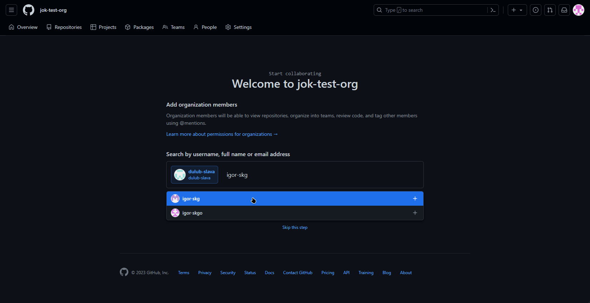

Состав организации:

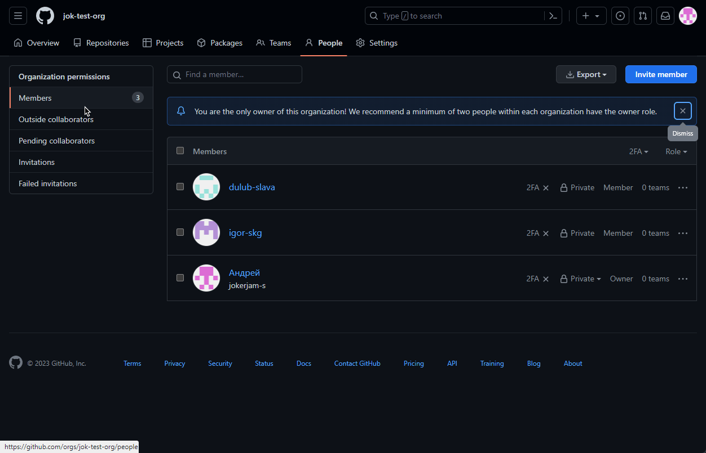

Создаем проект:

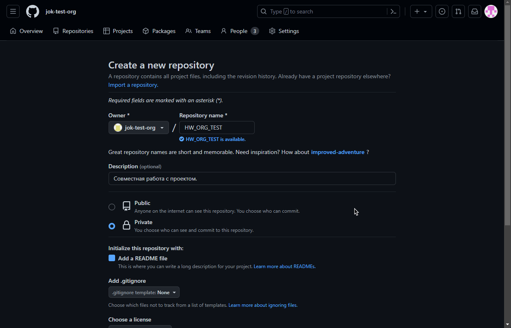

Добавляем пользователей к проекту:

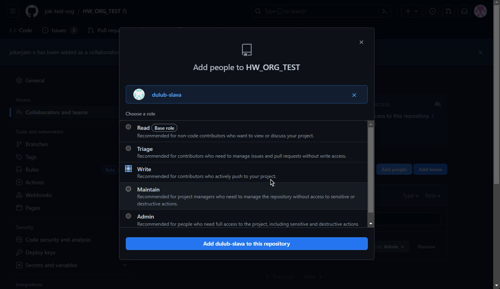

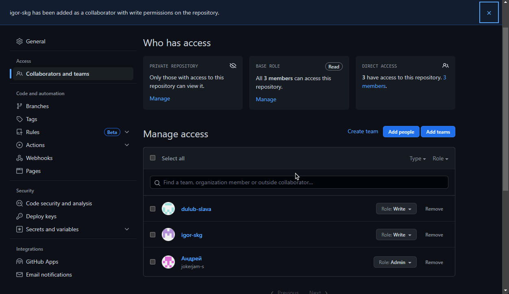

Создаем задачи:

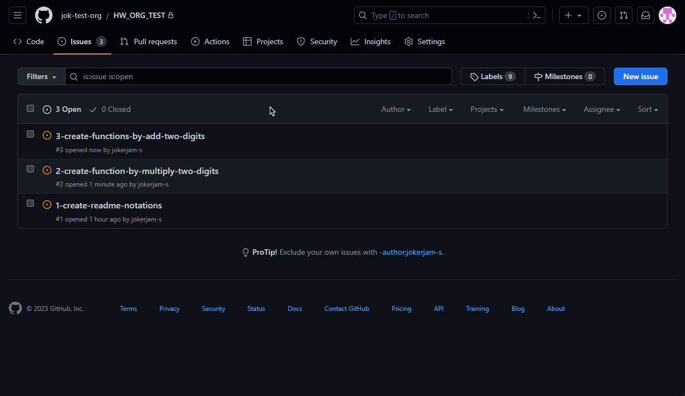

Распределяем задачи:

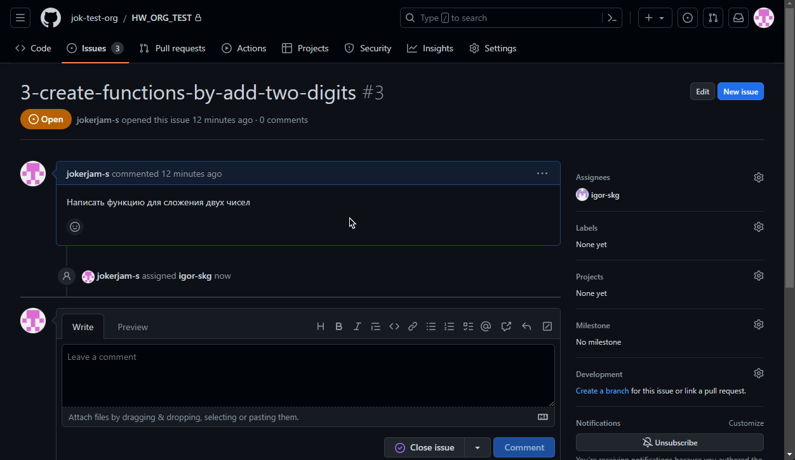

Получаем реквесты от исполнителей:

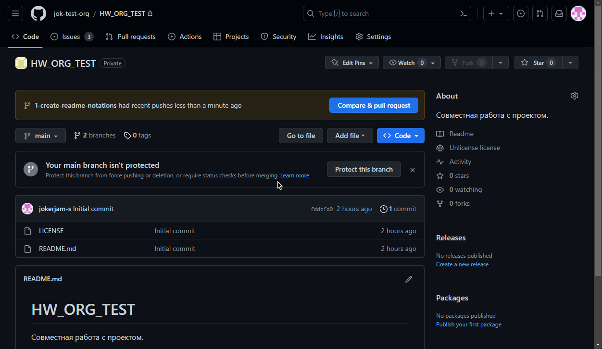

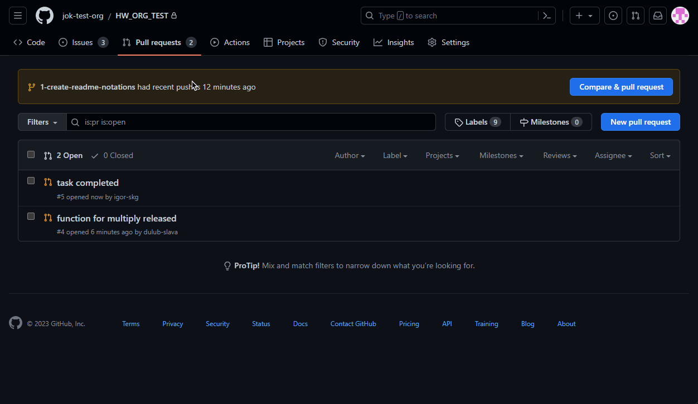

Собираем проект. Отмечаем выполнение заданий.

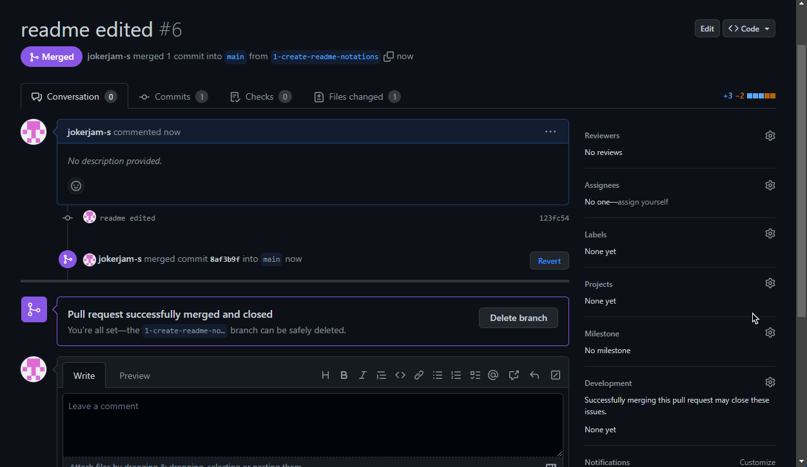

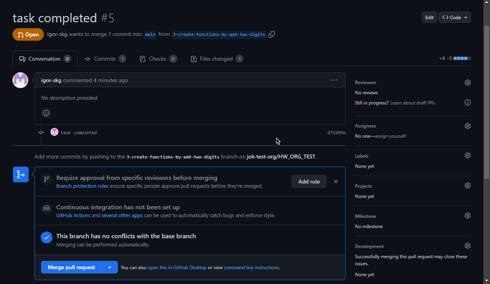

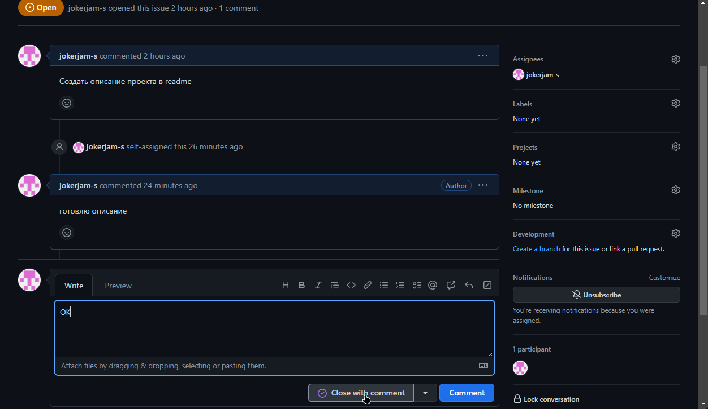

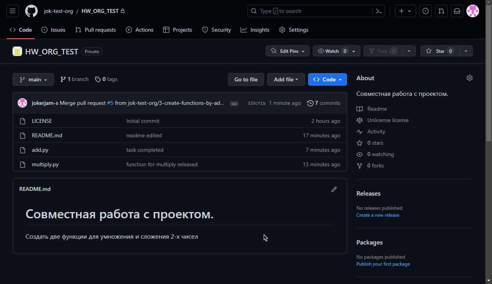
