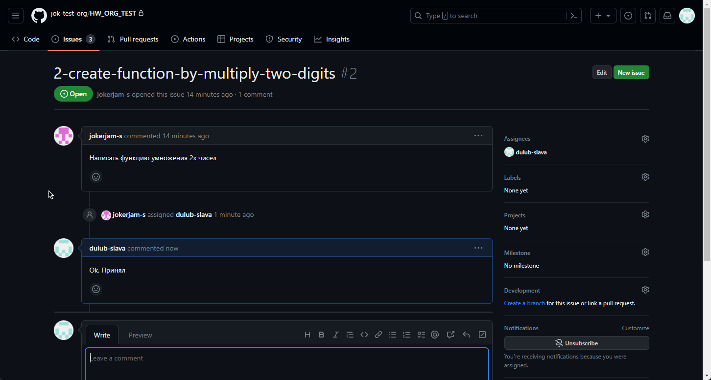

# Git. Совместная работа

Создаем организацию, добавляем пользователей:

Состав организации:

Создаем проект:

Добавляем пользователей к проекту:

Создаем задачи:

Распределяем задачи:

Получаем реквесты от исполнителей:

Собираем проект. Отмечаем выполнение заданий.

